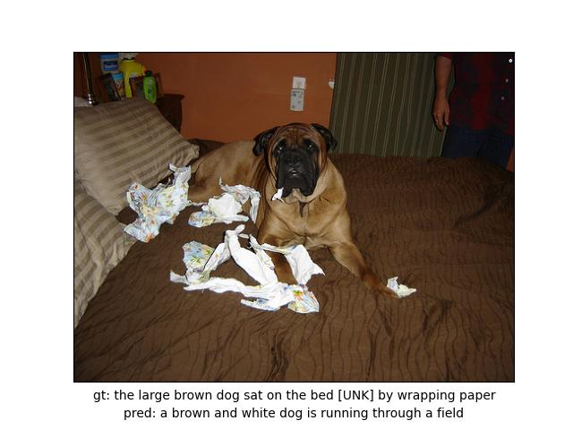
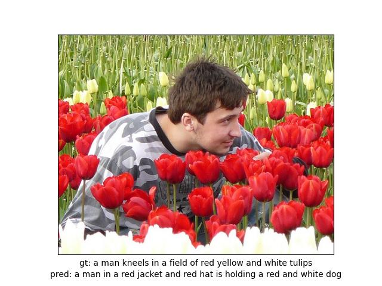

# 모델링 기법 선정 보고서

## 1. 프로젝트 주제
- 프로젝트의 목적 및 목표
  > 본 프로젝트는 강의 시간에 학습한 CNN 모델(VGG, ResNet 등)과 RNN 모델(LSTM, GRU)을 활용하여, 입력으로 이미지를 제공하면 해당 이미지의 내용을 텍스트로 추출하는 기능을 구현하는 것을 목표로 함.
- 프로젝트가 해결하고자 하는 문제와 그 중요성
  > - 박물관이나 전시관과 같은 그림 설명을 다루는 장소에서는 시각장애인들이 정보 접근에 어려움을 겪고 있음.
  > - 이러한 불편을 해소하기 위해 이미지 정보를 텍스트로 설명함으로써 정보 접근에 제한이 있는 사용자에게 포용성을 증대시키고자 함.
- 예상되는 결과와 영향
  > - 글로벌 사용자에 맞춰 다양한 언어로 이미지 설명을 제공할 수 있음.
  > - 시각 장애인을 포함한 각 국의 사용자에게 다양한 이미지의 접근성과 이해도를 높임.
  

## 2. 데이터 설명
- 사용 데이터 설명
  - 데이터 출처 - Kaggle
    

  - 데이터 타입: 이미지-텍스트 쌍
  - 데이터 크기: 총 8,000개의 Image와 40,000개의 caption. 
    이미지당 5개의 정답 캡션(문장)
    - Train set : 32,000개
    - Validation set : 4,000개
- 데이터 전처리 과정 및 방법
  - Image Resize: 이미지를 크기를 조정
  - Tensor 변환: 이미지를 텐서 형태로 변환
  - Normalization: 데이터를 정규화하여 모델 입력에 적합하게 변환
    

## 3. 모델링 기법 후보
- 고려된 모델링 기법
  - **Encoder** : 이미지 특징을 추출하는 `CNN(VGG, ResNet)`모델을 적용할 것을 고려함.
  - **Decoder** : 텍스트 데이터를 순차적으로 처리하는 `RNN(LSTM, GRU)`모델을 적용할 것을 고려함.
  - 모델의 예상 아키텍처
    - `Encoder`
      - Image를 입력받아 CNN 모델을 통해 Feature Map을 추출
      - 추출된 Feature Map을 Embedding 처리하여 Context Vector로 변환
    - `Decoder`
      - 추출된 Context Vector를 LSTM의 입력값으로 넣어 예상 텍스트로 변환
      

  - Pretrained 모델을 사용한 경우 고려한 모델들
    - CNN: BLIP, VGG16, ResNet101 등
    - RNN: BERT, BLIP
    

## 4. 모델 선정 기준 및 모델링 기법들 비교
- 성능 지표
    > ## **BLEU**
    > - 예측값과 실제값의 n-gram 일치도를 기반으로 동일한 가중치를 두어 유사도를 계산.
    > - 예측한 문장의 길이가 짧을 경우 큰 패널티가 부여됨.
    

    > ## **NIST**
    > - BLEU와 유사한 방식으로 n-그램을 사용하지만, 희귀한 n-그램에 더 큰 가중치를 부여.
    > - 문장 길이에 따른 영향을 적게 받음.

- 학습 시간 및 리소스 요구 사항 비교
  > **VGG + LSTM 모델**
    > - 학습 시간: 1 epoch 당 파라미터 설정 별로 약 90~200초 소요
    > - 파라미터 설정별 early stopping : **30~50 epoch**
    > - 학습 환경(GPU) : Google Colab(A100, L4), RTX 3060ti
- 모델의 장단점 분석
  - **VGG + LSTM 모델**
    - 장점: 학습 시간과 자원 소모가 상대적으로 적으며, 기본적인 이미지와 텍스트 처리에 적합함.
    - 단점: 복잡한 데이터나 대규모 데이터 처리에는 한계가 있음.
  - **ResNet + GRU 모델**
    - 장점: 복잡한 이미지 특징을 효율적으로 학습할 수 있음.
    - 단점: 학습 시간이 비교적 길고, 고성능의 GPU를 필요로 함.

## 5. 선정된 기법
- 최종 선정 모델링 기법
  > Encoder : VGG 모델의 Feature Extract Layer를 간소화하여 사용
  

  > Decoder :  Embedding Layer 1개와 LSTM Layer 1개로 구성
  
- 선정 이유
  - 여러 파라미터들을 조정해가며 학습하는데에 시간 소요가 많기 때문에 비교적 가벼운 레이어로 모델을 구성하여 사전 학습된 모델을 사용하지 않고, 주어진 데이터로 직접 학습을 진행하기 위함.
- 선정 모델의 구조
  - 모델의 아키텍처
    - Encoder
      
      출처 : Git Hub(https://github.com/sgrvinod/a-PyTorch-Tutorial-to-Image-Captioning)

  - 레이어 수
    - Encoder : Convolution Layer 5개, MaxPooling Layer 4개
    - Decoder :  Embedding Layer 1개, LSTM Layer 1개

  -  하이퍼 파라미터
      > **파라미터 수 : 15개** 
    "is_attn": 0 
    "img_size": 192 
    "enc_hidden_size": 14 
    "vocab_size": 10000, 
    "max_len": 32 
    "dec_hidden_size": 512 
    "dec_num_layers": 1 
    "dropout": 0.3 
    "batch_size": 64 
    "epochs": 100 
    "enc_lr": 0.0001 
    "dec_lr": 0.0004 
    "regularization_lambda": 1 
    "result_num": 10 
    "topk": 5 
    "early_stop_criterion": 5

  - 사용된 기술
    - Encoder : VGG 모델의 Feature Extract Layer를 간소화하여 사용
    - Decoder : Embedding Layer 1개와 LSTM Layer 1개
    - 평가 지표 - 총 4가지 기준으로 평가
        - BLEU: n-gram 2, n-gram 4인 경우.
        - NIST: n-gram 2, n-gram 4인 경우.

---

# 테스트 결과 보고서

## 1. 테스트 환경
- 하드웨어 : Google Colab(A100, L4), RTX 3060ti
- 소프트웨어 : Google Colab, [Pytorch 2.3.1, Cuda 11.8, Cudnn 8.7.0]

## 2. 테스트 결과
- Test 1 : 파라미터, 에폭 적고
  - Loss graph  
      
    Dataset 개수를 40,000으로 하여 학습하였을 때 최초로 과적합 발생, batch_size크기를 늘려 과적합 발생한 것으로 예상
    
  - Good Case  
      
    객체의 종류와 수(a group of people), 행동(are playing), 주변 환경(in a field)을 모두 설명  
      
    객체의 종류와 수(a group of people), 행동(are playing), 주변 환경(in a field)을 모두 설명  
    
  - Detail miss Case  
      
    객체의 종류와 숫자, 행동에 대해서 설명을 했으나 특징이 명확하지 않음(white jacket이라는 특징이 잘못)  
      
    객체의 종류와 특징에 대해 정확하게 설명하였으나 주변 환경의 관계가 정확하지 않음 (building 앞에 있지 않으나 앞에 있다고 묘사, 행동 묘사 오류)  
    
  - Bad Case  
      
    객체 종류와 수는 설명했지만, 주변 환경 및 행동 인식 실패  
      
    객체 1은 인식했으나, 객체 2(낙타)를 산으로 인식하며 실패  

- Test 2 : img_size : 192, batch_size : 64, encoder_lr : 0.00005, decoder_lr : 0.0001
  - Loss graph  
      
    train set의 loss와 test set의 loss가 비슷한 값으로 수렴하여 잘 학습되었다고 판단
  
  - Good Case  
      
    객체의 종류와 수(a group of people), 행동(are playing), 주변 환경(in a field)을 모두 설명 (사람이 판단했을 때는 유사하지만 두 문장에 대해 성능 지표를 통해 평가를 했을 때는 점수가 저조한 경우)  
      
    객체의 수와 종류를 구분하고(a dog) 행동(running)과 주변 환경(through the grass)까지 모두 설명  

  - Detail miss Case  
      
    객체의 종류와 숫자, 특징, 행동에 대해서 설명을 했으나 정확하진 않음(two hockey players -> group of people, hockey -> playing in the snow)  
      
    객체의 종류와 특징, 행동, 주변 환경에 대해 설명했으나 자세하진 못함 (two young boys -> a man, concrete barrier -> rock)  
  
  - Bad Case  
      
    객체 종류는 설명했지만, 객체의 수(two men -> a man), 특징(red shirt X), 행동(running X), 주변 환경(grass X) 설명 모두 실패  
      
    객체 특징, 행동 예측, 주변 환경, 맥락 설명 모두 실패  

- Test 3 : img_size : 192, batch_size : 64, encoder_lr : 0.00003, decoder_lr : 0.0001
  - Loss graph  
      
    과적합이 발생했지만 train set, test set 둘 다 loss 값이 가장 낮은 결과를 도출
  
  - Good Case  
      
    객체의 종류와 수(two dogs), 행동(are playing), 주변 환경(field of grass)을 모두 설명  
      
    객체의 수와 종류를 구분하고(man, dirt bike) 행동(riding)과 주변 환경(grassy field)까지 모두 설명  
  
  - Detail miss Case  
      
    객체의 성별, 행동은 설명했으나 특징을 잘못 설명 (yellow shirt -> blue shirt)  
      
    객체의 종류와 행동은 설명했으나 자세하진 못함  
  
  - Bad Case  
      
    객체 특징, 행동 예측, 주변 환경, 맥락 설명 모두 실패  
      
    객체 특징, 행동 예측, 주변 환경, 맥락 설명 모두 실패  
    
## 3. 분석
- 성능 평가 지표  
  : 문장의 특성상 예측한 문장과 ground true 문장이 유사한 의미여도 구조가 다르면 성능 평가에서는 낮은 점수를 기록할 수 있음, 따라서 함축된 의미까지 평가할 수 있는 방향으로 loss 함수의 변경이 필요

- 과적합 허용  
  : 앞서 말한 성능 평가 지표의 문제로 인해, 일정 수준의 과적합을 허용했을 때 성능이 향상될 것 이라고 예측했고, 테스트 결과를 직접 분석했을 때 과적합을 허용하지 않았을 때 보다 문장의 다양성과 표현이 풍부해지는 것을 확인

- 예측 결과의 특징  
  : 예측한 결과를 살펴봤을때 특정 단어들끼리 쌍을 지어 반복되는 패턴들이 관찰됨 (ex. man -> blue shirt, dog -> running, people -> front of building),  
  vocab_size와 데이터의 다양성의 한계가 원인일것으로 추정

---

# 프로세스 검토 결과 보고서

## 1. 프로젝트 진행 프로세스 설명
  1. 참고 논문 분석
  - 스터디 형식으로 각자 이해한 내용을 설명하며 토의
  - 참고 논문 : Show, Attend and Tell: Neural Image Caption Generation with Visual Attention
  - 참여자 : 김연중, 김인호, 이찬혁, 이하 동일

  2. 구현 방안 토의
  - 전체적인 모델의 대략적인 구조를 정함, 이후 세부적인 부분에 대해 적용할 레이어를 조사하고 어떤 것을 사용할지 결정 -> Encoder에는 VGG 모델의 Feature Extractor 부분, Decoder에는 LSTM Layer를 사용하기로 결정

  3. 모델 구현
  - 논문의 내용을 단순화한 모델링을 시도하는 과정에서 많은 오류가 발생하여 이미지 캡션 튜토리얼 코드를 참고하는 방향으로 결정
  - 참고 코드 1 : https://github.com/ljm565/image-captioning-show-attend-and-tell
  - 참고 코드 2 : https://github.com/sgrvinod/a-PyTorch-Tutorial-to-Image-Captioning

  4. 모델 최적화
  - 데이터셋의 크기와 하이퍼 파라미터를 조정해가며 결과를 비교

## 2. 프로세스별 결과
  1. 참고 논문 분석
  - 논문에서는 Encoder에 Resnet, Decoder에는 LSTM 사용, Hard Attention 사용

  2. 구현 방안 토의
    - 논문을 바탕으로 직접 모델링하는 과정에서 오류들을 해결하는데 많은 시간이 소요되었으며, 정해진 기한 내에 모델링을 하고 학습까지 진행하기가 어렵다고 생각하여 참고할만한 코드를 조사했음, 이후 해당 코드를 바탕으로 적절히 수정하는 방법을 선택
    - attention 부분을 제거하고 Encoder에 Resnet 모델 대신 Vgg 모델을 사용하는 식으로 구조를 단순화

  3. 모델 구현
    - 먼저 참고한 코드가 어떤 구조로 되어있는지 각자 분석을 진행하며, 다시 스터디 형식으로 서로 이해한 내용을 공유
    - hard attention을 적용한 모델과 그렇지 않은 모델을 만들어 두 경우의 성능을 비교하는 것을 목표로 함
    - hard attention을 적용한 모델을 구현하는 과정에서 해결할 수 없는 오류가 발생해 적용하지 않은 모델만 사용하기로 결정

4. 모델 학습 및 최적화
  - 최적화 과정
    - 학습 시간을 줄이기 위해 PC방에서 gpu를 이용하여 학습을 진행하려고 했으나, cuda와 cudnn을 설치하고 학습을 실행하는 과정에서 gpu가 인식되지 않는 문제가 반복되었고, 성공한 뒤에도 학습 과정중에 컴퓨터가 다운되는 경우가 많았음
    - 차선으로 구글 코랩(A100, L4)과 개인 데스크탑(3060ti)을 이용해 학습을 하기로 결정
    - A100의 경우 epoch당 약 1분, 3060ti의 경우 epoch당 약 3분 정도로 30 ~ 50 epoch으로 한번 학습하는데 약 2 ~ 3시간 소요
    - input img_size를 너무 크게 사용하면 학습이 종료되거나 컴퓨터가 다운되는 현상이 발생했고, 감소 시키면 모델의 성능이 하락했기 때문에 사용 가능한 값중 가장 큰 192를 사용
    - batch_size와 레이어의 hidden_size, 문장의 max_len은 너무 작은 값을 사용하는 경우가 아니면 성능에 미치는 영향이 적었음
    - data set의 크기를 증가시키면 학습 시간은 약간 늘어나지만, 성능이 향상되는 것을 확인
    - 따라서 data set의 크기는 4만으로, 나머지 하이퍼 파라미터들은 적절한 값으로 고정한 뒤, learning rate를 변경하여 최적화 과정을 완료함

5. 향후 개선점
  - 시간을 들여 encoder를 Resnet 구조로 변경하고 layer의 수를 늘리는 방식으로 실험을 진행
  - 해당 논문의 핵심 메커니즘인 hard attention에 대해 좀 더 공부하고 모델에 적용
  - 다른 data set을 사용하거나 기존 data set에 추가하여 성능 향상에 영향이 있는지 확인
