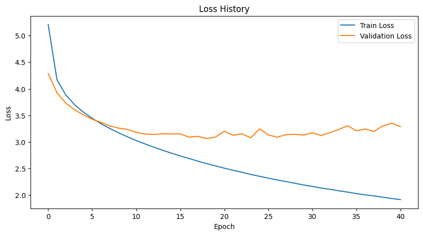
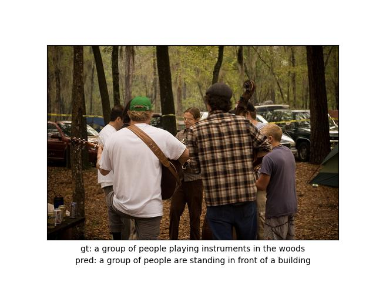
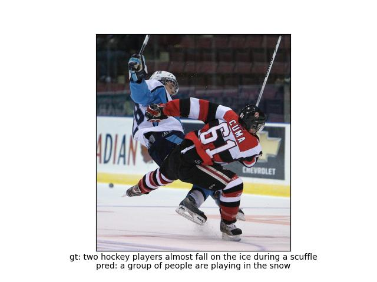
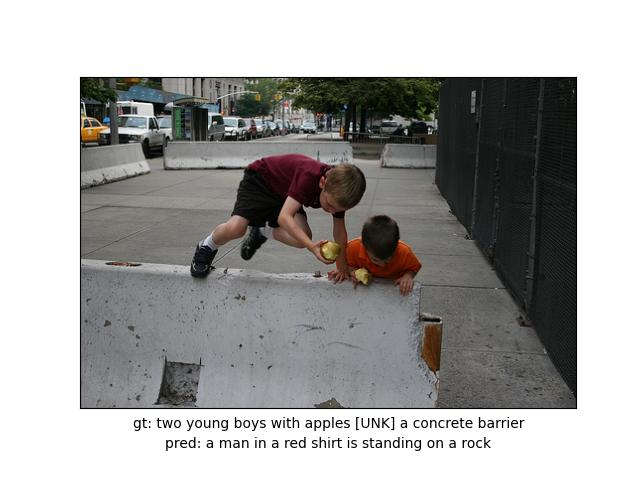
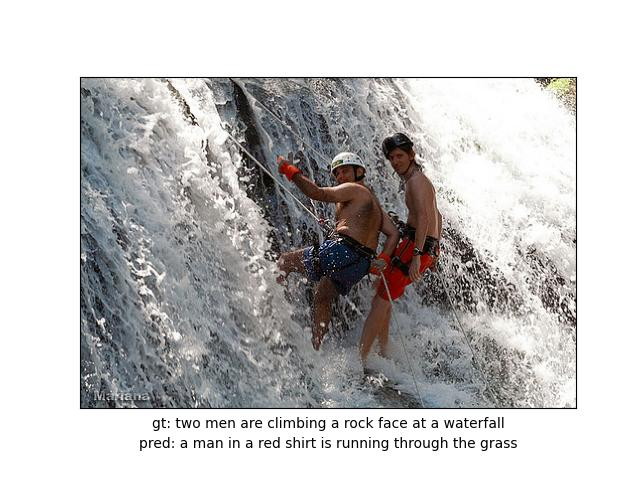
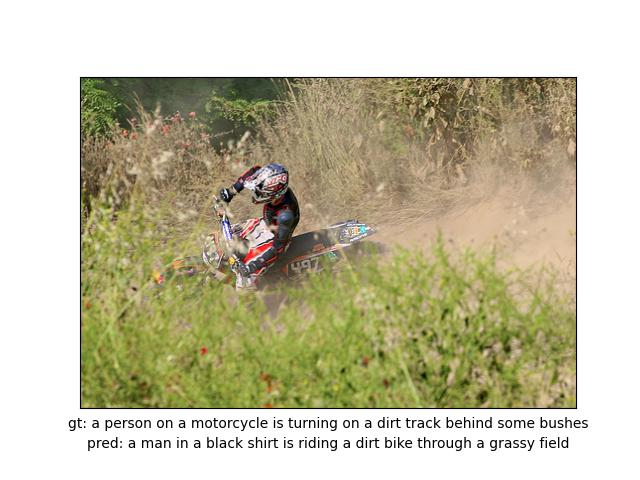
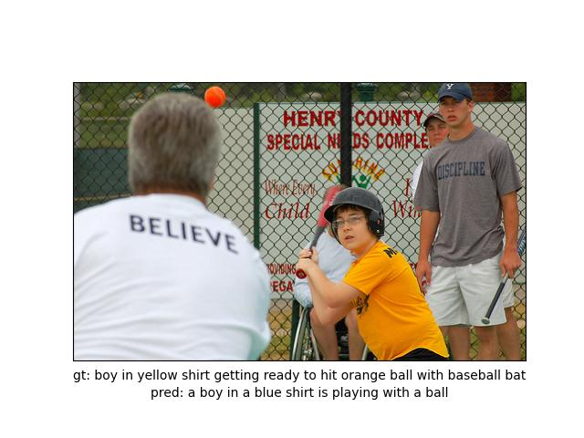

# 테스트 결과 보고서

## 1. 테스트 환경
- 하드웨어 : Google Colab(A100, L4), RTX 3060ti
- 소프트웨어 : Google Colab, [Pytorch 2.3.1, Cuda 11.8, Cudnn 8.7.0]

## 2. 테스트 결과
- Test 1 : 파라미터, 에폭 적고
  - Loss graph  
      
    Dataset 개수를 40,000으로 하여 학습하였을 때 최초로 과적합 발생, batch_size크기를 늘려 과적합 발생한 것으로 예상
    
  - Good Case  
      
    객체의 종류와 수(a group of people), 행동(are playing), 주변 환경(in a field)을 모두 설명  
      
    객체의 종류와 수(a group of people), 행동(are playing), 주변 환경(in a field)을 모두 설명  
    
  - Detail miss Case  
      
    객체의 종류와 숫자, 행동에 대해서 설명을 했으나 특징이 명확하지 않음(white jacket이라는 특징이 잘못)  
      
    객체의 종류와 특징에 대해 정확하게 설명하였으나 주변 환경의 관계가 정확하지 않음 (building 앞에 있지 않으나 앞에 있다고 묘사, 행동 묘사 오류)  
    
  - Bad Case  
      
    객체 종류와 수는 설명했지만, 주변 환경 및 행동 인식 실패  
      
    객체 1은 인식했으나, 객체 2(낙타)를 산으로 인식하며 실패  

- Test 2 : img_size : 192, batch_size : 64, encoder_lr : 0.00005, decoder_lr : 0.0001
  - Loss graph  
      
    train set의 loss와 test set의 loss가 비슷한 값으로 수렴하여 잘 학습되었다고 판단
  
  - Good Case  
      
    객체의 종류와 수(a group of people), 행동(are playing), 주변 환경(in a field)을 모두 설명 (사람이 판단했을 때는 유사하지만 두 문장에 대해 성능 지표를 통해 평가를 했을 때는 점수가 저조한 경우)  
      
    객체의 수와 종류를 구분하고(a dog) 행동(running)과 주변 환경(through the grass)까지 모두 설명  

  - Detail miss Case  
      
    객체의 종류와 숫자, 특징, 행동에 대해서 설명을 했으나 정확하진 않음(two hockey players -> group of people, hockey -> playing in the snow)  
      
    객체의 종류와 특징, 행동, 주변 환경에 대해 설명했으나 자세하진 못함 (two young boys -> a man, concrete barrier -> rock)  
  
  - Bad Case  
      
    객체 종류는 설명했지만, 객체의 수(two men -> a man), 특징(red shirt X), 행동(running X), 주변 환경(grass X) 설명 모두 실패  
      
    객체 특징, 행동 예측, 주변 환경, 맥락 설명 모두 실패  

- Test 3 : img_size : 192, batch_size : 64, encoder_lr : 0.00003, decoder_lr : 0.0001
  - Loss graph  
      
    과적합이 발생했지만 train set, test set 둘 다 loss 값이 가장 낮은 결과를 도출
  
  - Good Case  
      
    객체의 종류와 수(two dogs), 행동(are playing), 주변 환경(field of grass)을 모두 설명  
      
    객체의 수와 종류를 구분하고(man, dirt bike) 행동(riding)과 주변 환경(grassy field)까지 모두 설명  
  
  - Detail miss Case  
      
    객체의 성별, 행동은 설명했으나 특징을 잘못 설명 (yellow shirt -> blue shirt)  
      
    객체의 종류와 행동은 설명했으나 자세하진 못함  
  
  - Bad Case  
      
    객체 특징, 행동 예측, 주변 환경, 맥락 설명 모두 실패  
      
    객체 특징, 행동 예측, 주변 환경, 맥락 설명 모두 실패  
    
## 3. 분석
- 성능 평가 지표  
  : 문장의 특성상 예측한 문장과 ground true 문장이 유사한 의미여도 구조가 다르면 성능 평가에서는 낮은 점수를 기록할 수 있음, 따라서 함축된 의미까지 평가할 수 있는 방향으로 loss 함수의 변경이 필요

- 과적합 허용  
  : 앞서 말한 성능 평가 지표의 문제로 인해, 일정 수준의 과적합을 허용했을 때 성능이 향상될 것 이라고 예측했고, 테스트 결과를 직접 분석했을 때 과적합을 허용하지 않았을 때 보다 문장의 다양성과 표현이 풍부해지는 것을 확인

- 예측 결과의 특징  
  : 예측한 결과를 살펴봤을때 특정 단어들끼리 쌍을 지어 반복되는 패턴들이 관찰됨 (ex. man -> blue shirt, dog -> running, people -> front of building),  
  vocab_size와 데이터의 다양성의 한계가 원인일것으로 추정
